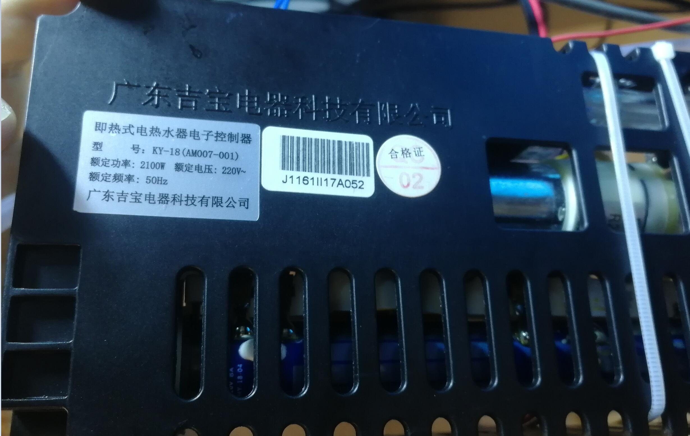
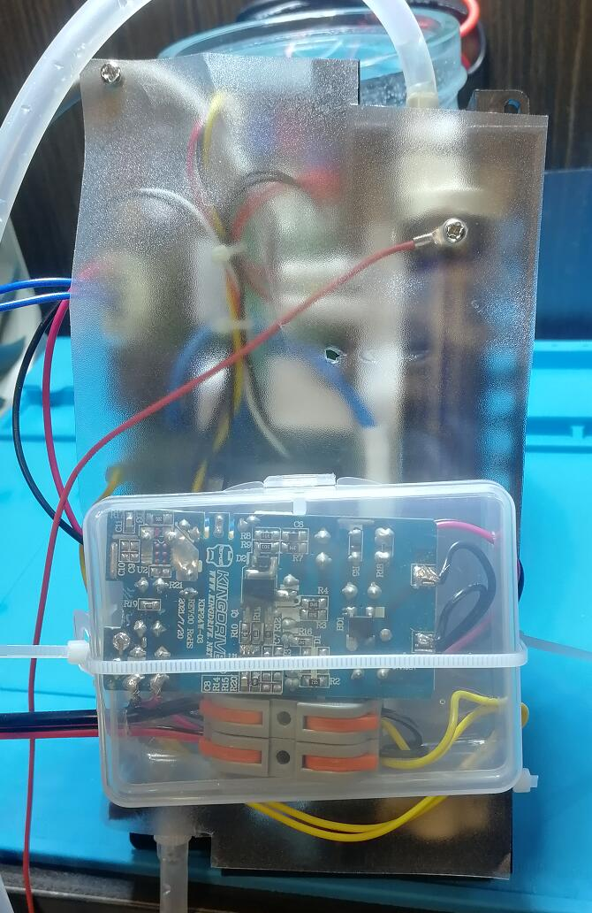

# 51即热开水器
适用于广东吉宝电器科技有限公司生产的即热式电热水器电子控制器，型号KY-18（AM007-001）（咸鱼价格30左右），即刷即用  

我设计的程序需要运行在22.1184Mhz的频率下，并且仅支持50Hz频率的交流电

## 温控算法
我自己设计的，而且不是PID，因为PID震荡总是停不下来，红色框是我手动调节的，用以测试它的抗逆性  
实测效果还可以，能做到±1度  

[原始数据](data/water.csv)

## v2.0改进
 * 继续优化算法，加热前几秒会让温度更高，抵消加热前的冷水
 * 重构数据包结构，加入CRC校验和Ack机制，这样就能检测通信错误和丢包而重传了
 * STM32写的上位机（显示板）已经做好了！

## v1.1改进
 * 加入定量出水功能
 * 改进错误码机制
 * 改进NTC采样，取平均值并且支持offset校准
 * 加入了保温开水壶子系统  
   废水阀和预留阀接口控制加热和保温继电器  
   紫外灯接口控制风冷散热风扇(akka 米家电热水壶)  
   原水TDS接口读取室温NTC  
   净水TDS接口读取水箱NTC  
   这两个接口并不能直接使用，自带的1K下拉电阻太小，需要外接10K下拉电阻到GND，我把它集成在开水壶原控制板上了
 * 烧开水算法自带除氯，风冷加速冷却，以及自适应沸点检测功能  
 * 上述功能均可通过HotWater_51.h文件开头的宏管理
## 通信协议
TTL Baud115200 Data8 Stop1 VerifyEven  
### 数据包格式  
 * U8 消息长度(包括消息类型，不包括校验码)  
 * U8 消息类型  
 * U8[消息长度] 消息数据  
 * U16 [消息长度 消息类型 消息数据]的CRC16校验  

 * 10ms未收到一个完整的数据包会重置接收缓冲  

 * 0x0 系统状态报告 | 状态改变 | 请求
 * 消息类型 = 0x02 | 0x03 (UART_ERROR)
 * ENUM {  
       0x0. 正常  

       可恢复错误  
       0x1. 缺水  
       0x2. 进水温度过高  
       0x3. 出水温度过高  
       0x4. 溢水检测  

       V1.1  
       0x5. 干烧保护  

       不可恢复错误 ( | 0x40)  
       0x0. 过零检测异常  
       0x1. 可控硅击穿  
       0x2. 进水NTC短路  
       0x3. 进水NTC开路  
       0x4. 出水NTC短路  
       0x5. 出水NTC开路  

       V1.1  
       0x6. 室温NTC短路  
       0x7. 室温NTC开路  
       0x8. 水箱NTC短路  
       0x9. 水箱NTC开路  
     }   错误码  
 * Bit[低水位 中水位 高水位 原水水位 废水水位 出水终止]  输入端口状态  
 * Bit[紫外灯 端口3 端口4 端口5 水泵 加热]  输出端口状态  
 * T16 入水温度  
 * T16 出水温度  
 * U16 出水水量[CNT]  
 * U16 电压[ADC]  
 * U16 频率[CNT]  
{  
  * 0x25 (Type=2, Length=5)  
  * ENUM 水箱状态 {  
       0. 未知
       1. 加热
       2. 除氯
       3. 冷却
       4. 保温
  }  
  * T16 "室温"
  * T16 水箱水温  
}  

 * 0x1 开始出水
   * T16 即热温度 0 - 95.0
   * U8 水流大小 1-6
   * U16 出水水量 0为不限制

 * 0x2 清除错误标记

 * 0x3 读取设置
  * 返回消息类型 = 0x04
  * T16 出水温度
  * U16 设定出水水量
{  
  * T16 保温温度
  * Bit[风冷]
}  

 * 0x4 初始化水箱  
   * Bit[烧水, 风冷]  
   * T16 保温温度 0 - 80.0  

上表中不返回数据包的数据包，会返回Ack数据包，包含两个字节：Recv ID和Recv CRC  

T16格式：int16_t一位伪小数，114=11.4摄氏度  
水量：每单位为1/7.5mL  
电压：乘以（0.433）得到真实电压，该值需要通过BandGap计算得出  
频率：乘以（1/10.24）得到真实频率  
大端序  

## 抄板走线  
控制芯片：STC15W4K32S4 LQFP32封装  
  
* P3.0/P3.1 通讯串口(1)  
* P1.0/P1.1 预留串口(2)  
	4.7kΩ上拉  
  
* P2.3/P3.5 空置  
  
### 输入  
* P2.6/P0.1/P0.3/P5.5/P5.4 低 中 高 废水 原水 水位  
* P2.5/CCP0_3 水流 磁性叶轮+霍尔传感器  
* P1.5/ADC5 出水温度 100kΩ NTC 一端直连VCC  
* P1.6/ADC6 进水温度 10kΩ NTC 一端直连VCC  
	2kΩ连接 10kΩ下拉 GND电容  
  
* P3.2/INT0 交流存在  
	* 高压侧  
		L => 棕橙黑橙棕 => U2_1 (靠里)  
		N => - D3(M7) + => U2_2 (靠外)  
		U2_1 => D4(?) => U2_2  
	* 低压侧  
		U2_3 (靠外) 1kΩ连接 4.7kΩ下拉 GND电容 => P3.2  
		U2_4 (靠里) => 10kΩ => T1_4  
* P1.7/ADC7 交流电压  
	* 高压侧  
		L => 棕橙黑橙棕 => T1_1  
		N => T1_2  
	* 低压侧  
		T1_3 (靠里) => 511 => T1_4 (靠外)  
		T1_3 => 电容 => T1_4  
		T1_3 => 2kΩ => P1.7  
		T1_4 => 10kΩ => GND  
  
* P1.3/ADC3 漏水检测  
	1kΩ连接 334下拉 GND电容  
  
* 原水TDS  
  * P1.4/ADC4 => 2kΩ => A (靠外)  
  * P2.7 => 1kΩ => A  
  * P0.2 => B (靠内)  
  
* 净水TDS  
  * P1.2/ADC2 => 2kΩ => A (靠外)  
  * P0.0 => 1kΩ => A  
  * P2.4 => B (靠内)  
  
### 输出  
  
* P2.2/PWM4 紫外灯  
* P2.1/PWM3 水泵  
* P2.0/P3.7 废水阀 预留阀  
	2kΩ连接 10kΩ下拉 0103M三极管  
  
* P3.3/P3.4 自吸泵(K2) 发热膜(K1)  
	2kΩ连接 10kΩ下拉 小三极管控制继电器  
  
* P3.6/CCP1_2 => 510Ω电阻 => 加热功率 MOC3021  
