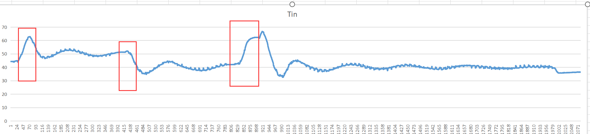

# 51即热开水器
适用于广东吉宝电子科技有限公司生产的即热式电热水器电子控制器，型号KY-18（AM007-001）（咸鱼价格30左右），即刷即用  

我设计的程序需要运行在22.1184Mhz的频率下，并且仅支持50Hz频率的交流电

## 温控算法
我自己设计的，而且不是PID，因为PID震荡总是停不下来，红色框是我手动调节的，用以测试它的抗逆性  
实测效果还可以，能做到±1度  

[原始数据](data/water.csv)
  
## 通信协议
TTL Baud115200 Data8 Stop1 VerifyEven  
### 数据包格式  
 * 0xAC 读取指定寄存器  
   * 0x00 输入端口状态  
     * 0x10 请求或输入端口状态改变时  
     * BITSET 低水位 中水位 高水位 原水水位 废水水位
   * 0x01 输出端口状态  
     * 0x11  
     * BITSET 紫外灯 端口3 端口4 端口5 水泵 加热  
   * 0x02 系统设置和交流电压  
     * 0x12  
     * T16 入水温度  
     * T16 出水温度  
     * T16 设定温度 0为常温  
     * U16 水流 Counter  
     * U16 电压 ADC  
     * U16 频率 Counter  
   * 0x03 错误码  
     * 0x80 请求或发生错误时 | ENUM 错误码 {  
       0. 无错误
       1. 进水温度过高
       2. 进水温度过低
       3. 出水温度过高
       4. 出水温度过低  
       5. 功率保护   
          读取交流电压，如果不为零那么可控硅已击穿  
          否则是没电  
       6. 缺水保护
       7. 溢水保护  
     }
  
 * 0x56 写入指定寄存器  
   * 0x00 清除错误标记  
   * 0x01 设置温度 0为冷水 恒温： 36 + (n-1) * 0.5度 最高90度  
   * 0x02 开关出水 0xA0 为关闭 0xA1 - 0xA6 为不同水流大小  
   * 0x07 设置溢水检测ADC阈值 (错误7)  
  bit on/off:  
   * 0x03 外部端口3  
   * 0x04 外部端口4  
   * 0x05 外部端口5  
   * 0x06 紫外灯  

关于T16格式：int16_t，但是114=11.4摄氏度  
关于水流：无量纲  
关于电压：乘以（0.433）得到真实电压，该值需要通过BandGap计算得出  
关于频率：乘以（1/10.24）得到真实频率  
大端序

## 抄板走线  
控制芯片：STC15W4K32S4 LQFP32封装  
  
* P3.0/P3.1 通讯串口(1)  
* P1.0/P1.1 预留串口(2)  
	4.7kΩ上拉  
  
* P2.3/P3.5 空置  
  
### 输入  
* P2.6/P0.1/P0.3/P5.5/P5.4 低 中 高 废水 原水 水位  
* P2.5/CCP0_3 水流 磁性叶轮+霍尔传感器  
* P1.5/ADC5 出水温度 100kΩ NTC 一端直连VCC  
* P1.6/ADC6 进水温度 10kΩ NTC 一端直连VCC  
	2kΩ连接 10kΩ下拉 GND电容  
  
* P3.2/INT0 交流存在  
	* 高压侧  
		L => 棕橙黑橙棕 => U2_1 (靠里)  
		N => - D3(M7) + => U2_2 (靠外)  
		U2_1 => D4(?) => U2_2  
	* 低压侧  
		U2_3 (靠外) 1kΩ连接 4.7kΩ下拉 GND电容 => P3.2  
		U2_4 (靠里) => 10kΩ => T1_4  
* P1.7/ADC7 交流电压  
	* 高压侧  
		L => 棕橙黑橙棕 => T1_1  
		N => T1_2  
	* 低压侧  
		T1_3 (靠里) => 511 => T1_4 (靠外)  
		T1_3 => 电容 => T1_4  
		T1_3 => 2kΩ => P1.7  
		T1_4 => 10kΩ => GND  
  
* P1.3/ADC3 漏水检测  
	1kΩ连接 334下拉 GND电容  
  
* 原水TDS  
  * P1.4/ADC4 => 2kΩ => A (靠外)  
  * P2.7 => 1kΩ => A  
  * P0.2 => B (靠内)  
  
* 净水TDS  
  * P1.2/ADC2 => 2kΩ => A (靠外)  
  * P0.0 => 1kΩ => A  
  * P2.4 => B (靠内)  
  
### 输出  
  
* P2.2/PWM4 紫外灯  
* P2.1/PWM3 水泵  
* P2.0/P3.7 废水阀 预留阀  
	2kΩ连接 10kΩ下拉 0103M三极管  
  
* P3.3/P3.4 自吸泵(K2) 发热膜(K1)  
	2kΩ连接 10kΩ下拉 小三极管控制继电器  
  
* P3.6/CCP1_2 => 510Ω电阻 => 加热功率 MOC3021  
